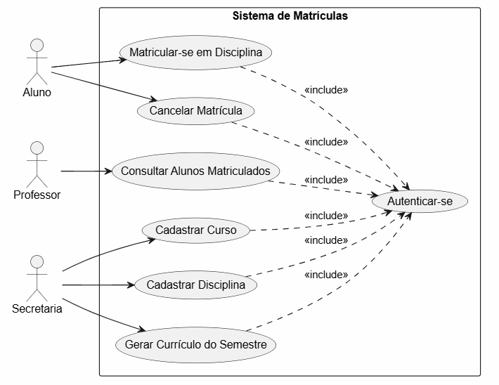
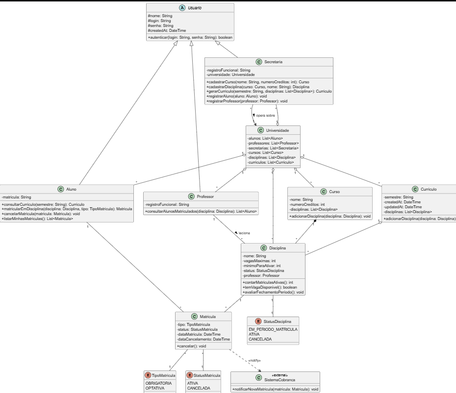

# Sistema de Matrículas — PUC Minas | Projeto de Software (2S2026)

Laboratório 2, Sprint 1 (Lab02S01): Modelo de Análise — Diagrama de Caso de Uso + Histórias de Usuário.

## 1. Contexto

Sistema de matrículas para uma universidade. A secretaria (departamento acadêmico da
universidade, não um cargo de secretária pessoal) mantém curso, disciplinas, professores
e alunos. Alunos se matriculam em disciplinas dentro de períodos de matrícula definidos;
professores consultam quem está matriculado em suas disciplinas.

## 2. Atores

| Ator | Papel |
|---|---|
| **Aluno** | Se matricula e cancela matrícula em disciplinas, dentro do período de matrículas vigente. |
| **Professor** | Consulta os alunos matriculados em cada disciplina que leciona. |
| **Secretaria** | Ator institucional (departamento acadêmico) — cadastra curso, cadastra disciplina, gera o currículo do semestre. |

Todos os atores autenticam-se com login e senha antes de qualquer operação.

## 3. Regras de negócio extraídas do enunciado

- Um curso tem nome, número de créditos, e é composto por diversas disciplinas.
- Um aluno se matricula em até 4 disciplinas obrigatórias (1ª opção) e até 2 disciplinas optativas (alternativas).
- Matrícula e cancelamento só podem ocorrer dentro do período de matrículas vigente.
- Uma disciplina só fica ativa no semestre seguinte se tiver, no mínimo, 3 alunos matriculados ao final do período de matrículas; caso contrário é cancelada. **Esta é uma regra aplicada por um processo de sistema (batch/agendado por prazo), sem ator humano acionando diretamente — por isso não aparece como caso de uso no diagrama, apenas documentada aqui e nos critérios de aceite.**
- O número máximo de alunos matriculados por disciplina é 60; ao atingir esse limite, as inscrições para a disciplina se encerram automaticamente.
- Ao se matricular, o sistema de matrículas notifica o sistema de cobranças (sistema externo). **Não é modelada como ator/UC no diagrama de caso de uso** — um sistema externo passivo, apenas notificado por evento, não atende à definição de ator UML (papel que interage diretamente buscando um objetivo). Fica registrada aqui como critério de aceite da história de matrícula.

## 4. Histórias de Usuário

### US01 — Autenticação
**Como** usuário do sistema (Aluno, Professor ou Secretaria),
**quero** informar login e senha,
**para** acessar as funcionalidades do sistema correspondentes ao meu papel.

*Critérios de aceite:*
- Credenciais inválidas impedem o acesso e exibem mensagem de erro.
- É pré-condição para todas as demais histórias abaixo.

---

### US02 — Matricular-se em disciplina
**Como** aluno,
**quero** me matricular em disciplinas durante o período de matrículas,
**para** cursar as disciplinas do semestre.

*Critérios de aceite:*
- Permite escolher até 4 disciplinas obrigatórias (1ª opção) e até 2 optativas (alternativas).
- Bloqueia matrícula fora do período de matrículas vigente.
- Bloqueia matrícula em disciplina que já atingiu 60 alunos matriculados (inscrições encerradas).
- Ao confirmar a matrícula, o sistema de cobranças é notificado para que o aluno seja cobrado pelas disciplinas do semestre.

---

### US03 — Cancelar matrícula
**Como** aluno,
**quero** cancelar uma matrícula feita anteriormente, dentro do período de matrículas,
**para** desistir de uma disciplina antes do fechamento do período.

*Critérios de aceite:*
- Só permite cancelamento dentro do período de matrículas vigente.
- Libera vaga na disciplina para outro aluno se o limite de 60 estava atingido.

---

### US04 — Consultar alunos matriculados
**Como** professor,
**quero** consultar a lista de alunos matriculados em cada disciplina que leciono,
**para** saber quem são meus alunos no semestre.

*Critérios de aceite:*
- Lista apenas alunos com matrícula confirmada.
- Restrito às disciplinas do próprio professor.

---

### US05 — Cadastrar curso
**Como** secretaria,
**quero** cadastrar um curso com nome e número de créditos,
**para** que ele exista na base do sistema e possa ter disciplinas associadas.

---

### US06 — Cadastrar disciplina
**Como** secretaria,
**quero** cadastrar disciplinas associadas a um curso,
**para** compor o currículo do curso.

---

### US07 — Gerar currículo do semestre
**Como** secretaria,
**quero** gerar o currículo (conjunto de disciplinas ofertadas) para cada semestre,
**para** disponibilizar as opções de matrícula aos alunos.

## 5. Diagrama de Caso de Uso



## 6. Notas de escopo da Sprint 1

- **Sistema de Cobranças** não é representado como ator no diagrama: é um sistema externo passivo, apenas notificado por evento após a matrícula, o que não atende à definição de ator UML (papel externo que interage diretamente com o sistema em busca de um objetivo). Fica documentado como regra de negócio e critério de aceite (US02).
- **Fechamento do período de matrículas** (regra dos 3 alunos mínimos por disciplina) não é um caso de uso acionado por ator: é um processo de sistema disparado por prazo/data, sem intenção humana direta por trás. Documentado como regra de negócio na Seção 3, fora do diagrama.

---

## 7. Sprint 2 (Lab02S02): Projeto Estrutural

### 7.1 Diagrama de Classes



Fonte PlantUML em [`diagrama-classes.puml`](diagrama-classes.puml).

### 7.2 Decisões de modelagem desta sprint

- **`Usuario`** é classe abstrata da qual `Aluno`, `Professor` e `Secretaria` herdam (nome, login, senha, `autenticar()`) — reflete o UC01 (`<<include>>`) do diagrama de caso de uso da Sprint 1.
- **`Universidade`** é a raiz agregadora do sistema (alunos, professores, secretarias, cursos, disciplinas, currículos), mas é uma classe de estado puro — só atributos e getters, sem métodos de cadastro. Quem tem intenção de negócio sobre esses dados é o ator `Secretaria`, não a estrutura de dados que os contém.
- **`Secretaria`** recebe uma referência a `Universidade` no construtor e é responsável por `cadastrarCurso()`, `cadastrarDisciplina()`, `gerarCurriculo()`, `registrarAluno()` e `registrarProfessor()` — esses métodos estavam inicialmente (por engano) na própria `Universidade`, o que violava a separação entre ator (comportamento) e estrutura de dados; corrigido antes do commit.
- **`Matricula`** é classe associativa entre `Aluno` e `Disciplina`, carregando `tipo` (OBRIGATORIA/OPTATIVA), `status` e datas — é onde a regra de 4 disciplinas obrigatórias + 2 optativas (Seção 3) deve ser validada, em `Aluno.matricularEmDisciplina()`.
- **`Disciplina`** carrega `vagasMaximas` (60), `minimoParaAtivar` (3) e `status` (`StatusDisciplina`), cobrindo as regras de capacidade e ativação da Seção 3.
- **`Curriculo`** agrega uma lista de disciplinas (não uma só), alinhado com a US07 ("conjunto de disciplinas ofertadas").
- **`consultarNota()`** cogitado no rascunho inicial foi removido — não há menção a notas/avaliação no enunciado do PO; seria escopo não pedido.
- **`SistemaCobranca`** aparece como classe `<<external>>`, notificada por `Matricula` via dependência `<<notify>>` — no diagrama de classes isso é aceitável como integração, diferente do diagrama de caso de uso (onde não é modelado como ator, ver Seção 6).

### 7.3 Projeto estrutural Java

Código-fonte em [`src/sistemamatriculas/`](src/sistemamatriculas/), pacote `sistemamatriculas`. Contém as classes, atributos e assinaturas de métodos (stub) modeladas no diagrama de classes acima — sem lógica de negócio implementada (métodos lançam `UnsupportedOperationException`), sem build tool (compilação direta via `javac`).

Estrutura:
```
src/sistemamatriculas/
├── Usuario.java            (abstrata)
├── Aluno.java
├── Professor.java
├── Secretaria.java
├── Universidade.java
├── Curso.java
├── Disciplina.java
├── Curriculo.java
├── Matricula.java
├── SistemaCobranca.java
├── TipoMatricula.java      (enum)
├── StatusMatricula.java    (enum)
└── StatusDisciplina.java   (enum)
```

Para compilar:
```
javac -d out src/sistemamatriculas/*.java
```

A implementação da lógica de negócio, interface (linha de comando) e persistência em arquivos ficam para a Sprint 3 (Lab02S03), conforme o enunciado.
